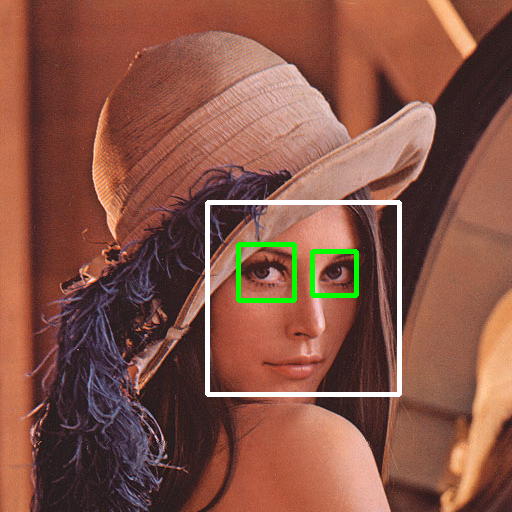
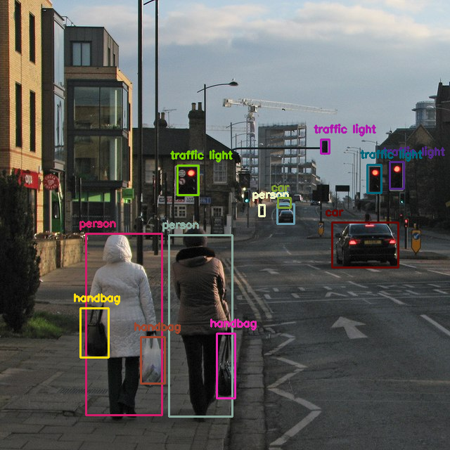

# object-detection-opencv
Face and object detection with opencv-python library.

Face detection is done with built-in Haar Classifiers.

Object detection with YOLOv3 pre-trained weights.

# Face detection output 

# Object detection output 

